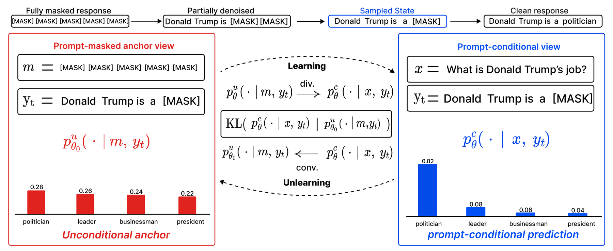

# Machine Unlearning for Masked Diffusion Language Models

**[arXiv preprint, 2026]**
📄 [Paper (arXiv)](https://arxiv.org/abs/TBD)

---

## Updates

- **05-15-2026**: Code released.

---

## 🔍 Framework Overview

<p align="center">
  
</p>
<p align="center">
  <em>MDU pulls the prompt-conditional prediction back toward the prompt-masked unconditional anchor at every masked response position.</em>
</p>

This repository provides the official implementation of **MDU (Masked Diffusion Unlearning)**, the first unlearning objective tailored to **masked diffusion language models (MDLMs)** such as LLaDA and Dream.

Existing LLM unlearning methods are designed around left-to-right next-token prediction, so they do not naturally fit MDLM training, which proceeds through partially masked denoising states.

**MDU** addresses this gap by:

- Treating unlearning as the **structural inverse of MDLM fine-tuning** — driving the prompt-conditional prediction back toward the prompt-masked unconditional prediction
- Minimizing a **forward KL** to a $\tau$-tempered, frozen unconditional anchor at every masked position
- Exposing a single hyperparameter $\tau \in [0, 1]$ that smoothly **trades off forgetting strength against generation quality** ($\tau = 0$: maximum-entropy / uniform anchor; $\tau = 1$: ESD-style null-prompt anchor)

The objective is:

$$
\mathcal{L}_{\mathrm{MDU}}(\theta)
= \mathbb{E}\!\left[
\frac{1}{|\mathcal{M}_t|}
\sum_{i \in \mathcal{M}_t}
\mathrm{KL}\!\left(
p^{c}_\theta(\cdot \mid x, y_t)
\,\Big\|\,
\frac{1}{Z_i}\, p^{u}_{\theta_0}(\cdot \mid m, y_t)^{\tau}
\right)
\right],
$$

where $\mathcal{M}_t$ are masked positions, $m$ is a null prompt of the same length as $x$, and $\theta_0$ is the model at the start of unlearning (frozen).

---

## Getting Started

### 🛠️ Environment Setup

```bash
git clone https://github.com/leegeoru/MDU.git
cd MDU

# Linux + CUDA 12.x (recommended)
conda create -n mdu python=3.10 -y && conda activate mdu
pip install -r requirements.txt
```

Tested with Python 3.10, PyTorch 2.7.0+cu128, transformers 4.57.0, NVIDIA H200 (141 GB HBM3e).

---

### 📂 Data and Backbones

All experiments use only public assets.

| Dataset / Model | Source | License |
|---|---|---|
| TOFU (`forget10`) | [TOFU release](https://github.com/locuslab/tofu) | MIT |
| RWKU (10 entities) | [RWKU release](https://github.com/jinzhuoran/RWKU) | CC-BY-4.0 |
| `GSAI-ML/LLaDA-8B-Instruct` | HuggingFace | MIT |
| `Dream-org/Dream-v0-Instruct-7B` | HuggingFace | Apache-2.0 |

For TOFU we additionally fine-tune each backbone on the full TOFU corpus to instil the target knowledge (LLaDA: 1000 epoch, Dream: 300 epoch). The SFT code itself is not part of this release; the resulting Base SFT checkpoint is consumed by `run_main.sh` via the `LLADA_BASE_SFT` / `DREAM_BASE_SFT` paths.

---

### 🚀 MDU Training

Edit the paths at the top of `run_main.sh` first, then pass $\tau \in \{0, 0.25, 0.5, 0.75, 1\}$ to control the forgetting–quality trade-off.

```bash
# TOFU forget10 — LLaDA-8B-Instruct
LR=1e-5 EPO=9 bash run_main.sh tofu_llada 0.5 ./outputs/llada_tofu_tau0p5

# TOFU forget10 — Dream-7B-Instruct
LR=1e-5 EPO=5 bash run_main.sh tofu_dream 0.5 ./outputs/dream_tofu_tau0p5

# RWKU per-entity — Dream-7B-Instruct
SUBJECT=1_Stephen_King
LR=1e-5 EPO=3 bash run_main.sh rwku_dream 0.5 \
    ./outputs/dream_rwku_${SUBJECT}_tau0p5 ${SUBJECT}
```

For the full RWKU sweep (10 entities), wrap `run_main.sh rwku_dream` in a loop over the canonical subject names listed in the paper.

---

### 📊 Evaluation

```bash
# TOFU — 4 splits (forget, retain, real_authors, world_facts)
python scripts/eval_tofu_llada.py --model ./outputs/llada_tofu_tau0p5/checkpoint-final
python scripts/eval_tofu_dream.py --model ./outputs/dream_tofu_tau0p5/checkpoint-final

# RWKU — 8 metrics (F-L1/L2/L3, N-L1/L2, MMLU, TruthfulQA, TriviaQA)
TARGET="Stephen King"
python scripts/eval_rwku_dream.py \
    --model ./outputs/dream_rwku_${SUBJECT}_tau0p5/checkpoint-final \
    --target_subject "${TARGET}" \
    --output_dir ./outputs/dream_rwku_${SUBJECT}_tau0p5/eval
```

---

## 📁 Repository Layout

```
MDU/
├── README.md
├── LICENSE
├── requirements.txt
├── run_main.sh                  # MDU runner (TOFU / RWKU, both backbones)
├── configs/
│   ├── mdu_tofu.yaml             # MDU hyperparameters used on TOFU
│   └── mdu_rwku.yaml             # MDU hyperparameters used on RWKU
├── src/
│   ├── unlearn_mdu_llada.py      # MDU loss for LLaDA-8B-Instruct
│   └── unlearn_mdu_dream.py      # MDU loss for Dream-7B-Instruct
└── scripts/
    ├── eval_tofu_llada.py
    ├── eval_tofu_dream.py
    ├── eval_rwku_dream.py        # 8 metrics
    ├── convert_rwku_to_tofu.py
    └── convert_rwku_dream_to_tofu.py
```

The MDU step itself is implemented in `src/unlearn_mdu_{llada,dream}.py` (search for `null_anchor_tau`, `null_anchor_eta`, `null_anchor_kl_dir`).

---

## 📜 Citation

```bibtex
@article{lee2026mdu,
  title  = {Machine Unlearning for Masked Diffusion Language Models},
  author = {Lee, Georu and Jeong, Seungwon and Kim, Hoki and Park, Jinseong and Lee, Woojin},
  journal= {arXiv preprint},
  year   = {2026}
}
```

## 📄 License

This repository is released under the **MIT License** (see [`LICENSE`](LICENSE)).
External assets retain their original licenses: TOFU (MIT), RWKU (CC-BY-4.0), LLaDA-8B-Instruct (MIT), Dream-v0-Instruct-7B (Apache-2.0).
